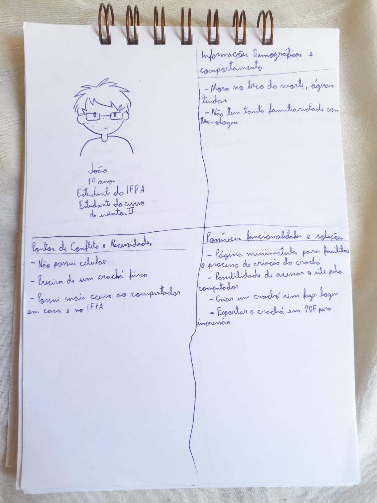
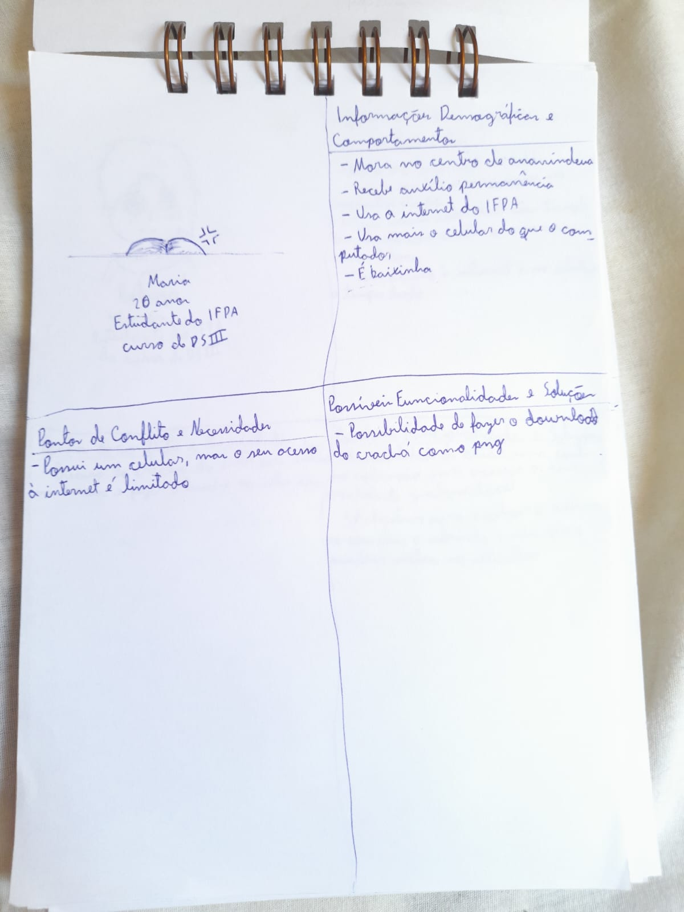
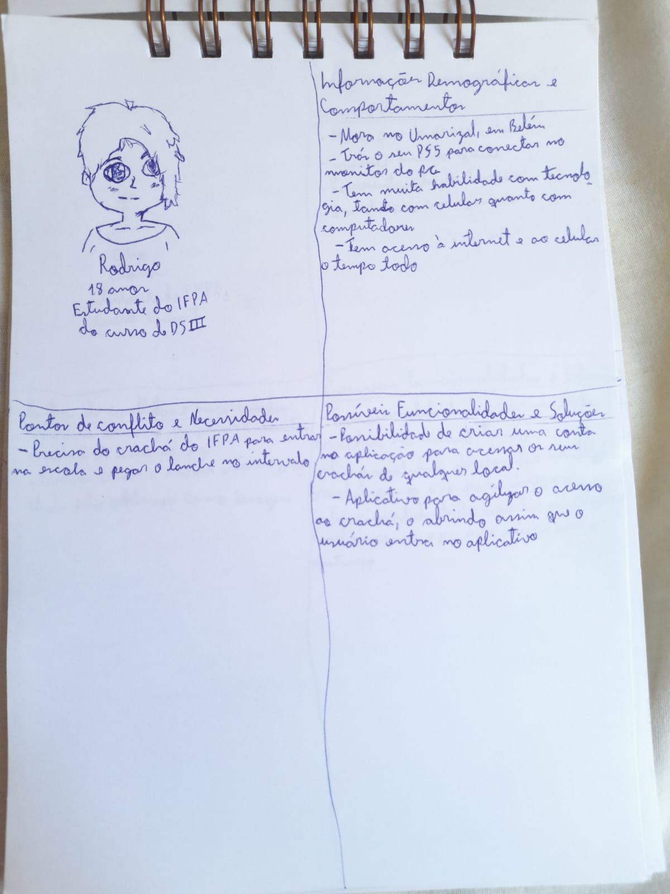
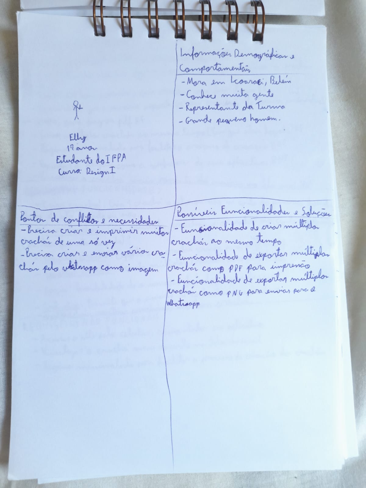

# Funcionalidades

Nesta seção serão definidas as funcionalidades iniciais do sistema a partir da criação de proto personas. Essas funcionalidades futuramente serão melhoradas e modificadas para serem criados os casos de uso.

## Tabela de Conteúdos

## Table of Contents

- [Funcionalidades](#funcionalidades-1)
- [Proto Personas](#proto-personas)
  - [João](#joão)
    - [Informações Demográficas e Comportamentos](#informações-demográficas-e-comportamentos)
    - [Pontos de Conflito e Necessidades](#pontos-de-conflito-e-necessidades)
    - [Possíveis Funcionalidades e Soluções](#possíveis-funcionalidades-e-soluções)
  - [Maria](#maria)
    - [Informações Demográficas e Comportamentos](#informações-demográficas-e-comportamentos-1)
    - [Pontos de Conflito e Necessidades](#pontos-de-conflito-e-necessidades-1)
    - [Possíveis Funcionalidades e Soluções](#possíveis-funcionalidades-e-soluções-1)
  - [Rodrigo](#rodrigo)
    - [Informações Demográficas e Comportamentos](#informações-demográficas-e-comportamentos-2)
    - [Pontos de Conflito e Necessidades](#pontos-de-conflito-e-necessidades-2)
    - [Possíveis Funcionalidades e Soluções](#possíveis-funcionalidades-e-soluções-2)
  - [Elly](#elly)
    - [Informações Demográficas e Comportamentos](#informações-demográficas-e-comportamentos-3)
    - [Pontos de Conflito e Necessidades](#pontos-de-conflito-e-necessidades-3)
    - [Possíveis Funcionalidades e Soluções](#possíveis-funcionalidades-e-soluções-3)

## Funcionalidades

Nessa seção são definidas as funcionalidades que foram escolhidas após as análises das personas.

As funcionalidades definidas foram:

- Acessar o site pelo celular e pelo computador, além da opção de um aplicativo android;
- Possibilitar ao usuário fazer o login para salvar os crachás;
- Se o usuário estiver logado, ele pode gerenciar os seus crachás (criar, ver, modificar, deletar);
- Se o usuário estiver logado ele visualiza o crachá mais recente na tela inicial.
- Possibilitar que o usuário crie um crachá sem fazer login;
- Criar múltiplos crachás ao mesmo tempo;
- Possibilitar que o usuário exporte os seus crachás de forma individual ou em grupo, para pdf ou em png;
- Página minimalista para facilitar o processo de criação dos crachás;

## Proto Personas

### João

- 17 anos;
- Estudante do IFPA;
- Faz Eventos II.

#### Informações Demográficas e Comportamentos

- Mora no beco da morte, Águas Lindas;
- Não tem tanta familiaridade com tecnologia.

#### Pontos de Conflito e Necessidades

- Não possui celular;
- Precisa de um crachá físico;
- Possui acesso ao computador em casa e no IFPA.

#### Possíveis Funcionalidades e Soluções

- Página minimalista para facilitar o processo de criação do crachá;
- Possibilidade de acessar o site pelo computador;
- Criar um crachá sem fazer login;
- Exportar o crachá em PDF no tamanho correto para impressão;

## Maria

- 20 anos;
- Estudante do IFPA;
- Faz DS III.

#### Informações Demográficas e Comportamentos

- Mora no centro de Ananindeua;
- Recebe auxílio permanência;
- Usa mais o celular do que o computador.

#### Pontos de Conflito e Necessidades

- Possui um celular, mas o seu acesso à internet é limitado.

#### Possíveis Funcionalidades e Soluções

- Possibilidade de fazer o download do crachá como PNG.

### Rodrigo

- 18 anos;
- Estudante do IFPA;
- Faz DS III.

#### Informações Demográficas e Comportamentos

- Mora no Umarizal, em Belém;
- Tem muita habilidade com tecnologia, tanto com celular quanto com o computador;
- Tem acesso à internet e à um celular a qualquer momento.

#### Pontos de Conflito e Necessidades

- Precisa de um crachá do IFPA para entrar na escola e pegar o lanche no intervalo.

#### Possíveis Funcionalidades e Soluções

- Possibilidade de criar uma conta na aplicação para acessar os seus crachás de qualquer local.
- Acesso rápido ao crachá, abrindo-o assim que o usuário entra no aplicativo.

### Elly

- 17 anos;
- Estudante do IFPA;
- Faz Design I.

#### Informações Demográficas e Comportamentos

- Mora em Icoaraci, Belém;
- Conhece muita gente;
- Representante da turma.

#### Pontos de Conflito e Necessidades

- Precisa criar e imprimir muitos crachás de uma só vez;
- Precisa criar e enviar vários crachás pelo Whatsapp como imagens.

#### Possíveis Funcionalidades e Soluções

- Possibilidade de criar e armazenar uma série de crachás ao mesmo tempo;
- Possibilidade de exportar múltiplos crachás como PNG e como pdf para impressão;
- Possibilidade de compartilhar crachás como PNG pelo whatsapp.